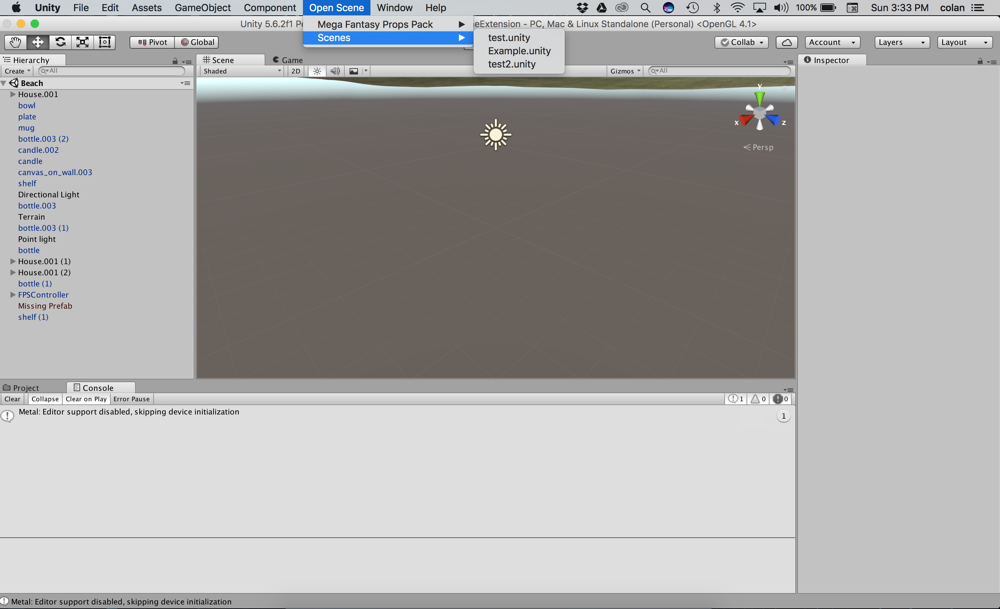

# UnitySceneExtension

This will add a drop down menu to Unity that allows you to go to your desired scenes without having to navigate the explorer. Simply add the editor folder to your project and it will work without any effort beyond that on your part.



## Notes

This project will modify your ```.gitignore``` file if present and add two files to be ignored:

	1. SceneMenu.cs
	2. SceneMenu.cs.meta

```SceneMenu.cs``` is an auto-generated file that is responsible for the drop down menu. 